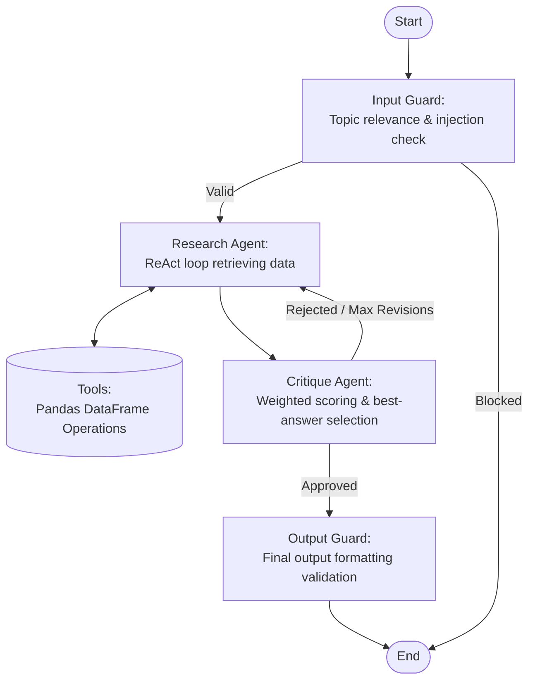

# CortexRE — Real Estate Asset Management Agent

An AI-powered assistant for querying and analysing a real estate portfolio. Ask questions in plain English; the agent retrieves the right numbers from the underlying dataset and responds with a clear, formatted summary.

## Features

The agent answers natural-language questions about a real estate portfolio:

| Capability                        | Description                                                                          |
| --------------------------------- | ------------------------------------------------------------------------------------ |
| **Property P&L**                  | Revenue, expenses, and NOI for a specific property, optionally filtered by year      |
| **Portfolio Summary**             | Aggregate financials (revenue, expenses, NOI) across all properties for a given year |
| **Operating Expense Ratio (OER)** | Ratio of expenses to revenue for a property in a given year                          |
| **Year-over-Year Growth**         | YoY growth rates for NOI, revenue, or expenses per property                          |
| **Property Comparison / Ranking** | Rank all properties by a financial metric (e.g., best/worst NOI)                     |
| **Top Expense Drivers**           | Largest expense categories across the portfolio or a specific property               |
| **Tenant Revenue Summary**        | Revenue breakdown per tenant, optionally scoped to a property or tenant name         |
| **Flexible Portfolio Query**      | Custom group-by queries with filters and metric aggregation                          |

Additional capabilities:

- **Provider-agnostic LLM** — swap between OpenAI, Anthropic, Ollama, or any LiteLLM-supported model with one env var.
- **REST API** — FastAPI backend with Swagger docs at `/docs`.
- **Chat UI** — Streamlit frontend for interactive exploration.
- **EDA UI** — Streamlit data-explorer tab for raw portfolio browsing.
- **TruLens evaluation** — LLM-graded answer relevance, groundedness, and context relevance.

---

## Agent Architecture

### Workflow Graph

The system is a four-node LangGraph pipeline. Each node is isolated and stateful; updates are pushed to the shared `AgentState` automatically.



### Why not `create_pandas_dataframe_agent`?

While LangChain provides a built-in agent, we explicitly built a custom LangGraph implementation for:

- **Security**: Strict limitation to predefined, safe `@tool` functions rather than an arbitrary Python REPL.
- **Guardrail Architecture**: Our custom pipeline (Input Guard → Research Agent → Critique Agent → Output Guard) allows us to intercept reasoning, critique hallucinations, and enforce boundary conditions.
- **Model Compatibility**: Uses isolated Markdown prompts, ensuring high compatibility across various providers via LiteLLM.
- **Custom Error Handling**: Gracefully catches data issues and returns helpful, human-readable `ToolError` messages.

### Key Components

| Node               | Responsibility                                                                                                                                              |
| ------------------ | ----------------------------------------------------------------------------------------------------------------------------------------------------------- |
| **Input Guard**    | Rejects off-topic or injected queries before any tool call                                                                                                  |
| **Research Agent** | ReAct loop — calls pandas tools until it has enough data to draft an answer                                                                                 |
| **Critique Agent** | Scores every draft on four weighted dimensions (accuracy ×4, completeness ×3, clarity ×2, format ×1); approves if ≥ 80/100, otherwise loops or selects best |
| **Output Guard**   | Validates the final answer format and strips any internal reasoning leakage                                                                                 |

#### Prompt Management

System prompts are maintained as stand-alone Markdown files in `src/agents/prompts/`. This allows rapid iteration on agent behavior without modifying implementation code.

---

## Multi-agent Workflow

### ReAct Pattern with Safeguards

The agent uses a ReAct reasoning loop fortified by multi-layer defence:

1. **Research Agent** explicitly forbids internal reasoning in its `final_answer`.
2. **Critique Agent** verifies the draft against tool logs and requests corrections if leakage or hallucinations occur.
3. **Output Guard** performs a final pattern scan to reject non-compliant output.

---

## Quick Start

### Prerequisites

- Python ≥ 3.13
- [`uv`](https://docs.astral.sh/uv/) package manager

### Setup

```bash
# 1. Install dependencies
make install

# 2. Configure environment
cp .env.example .env
# Edit .env: set LLM_MODEL and the matching API key
```

### Run

```bash
make run-api   # FastAPI backend  → http://localhost:8000
make run-ui    # Streamlit UI     → http://localhost:8501
```

### Docker

```bash
make docker-up    # Build and start all services
make docker-down  # Stop and remove containers
```

---

## Sample Queries

| Query                                         | What it does                    |
| --------------------------------------------- | ------------------------------- |
| "What is the P&L for Building A in 2024?"     | Property-level income statement |
| "Compare all properties by NOI"               | Portfolio-wide ranking          |
| "Which property had the highest OER in 2025?" | Operating expense ratio         |
| "How did NOI grow from 2024 to 2025?"         | Year-over-year growth           |

---

## Evaluation

Quantitative performance measurement using **TruLens**:

- **Answer Relevance**: Does the answer address the user's question?
- **Groundedness**: Is the answer supported _only_ by the retrieved data?
- **Context Relevance**: Is the context passed to the LLM on-topic?

```bash
make evaluate
# or for the dashboard:
uv run python -m src.evaluation.evaluation --dashboard
```

---

## Challenges & Solutions

Our design process focused on moving beyond simple "Chat with Data" templates towards a robust, production-ready agentic system.

### 1. Workflow Design: Modularity over Monoliths

**Challenge**: Standard LangChain agents (like `create_pandas_dataframe_agent`) are monolithic "black boxes" that execute arbitrary Python code. This poses significant security risks (REPL access) and makes it impossible to intercept or critique the reasoning process before the user sees an answer.

**Solution**: We implemented a custom **LangGraph** topology. By breaking the agent into discrete nodes (`Input Guard` → `Research` → `Critique` → `Output Guard`), we gained:

- **Total Control**: We can block malicious queries early or loop back for revisions without exposing the raw tool output.
- **Traceability**: Each node appends to a shared `steps` list, enabling the "Thinking Process" visualization.
- **Node Isolation**: Different prompts and models can be used for different stages (e.g., a smaller model for guards, a larger one for research).

### 2. Critique Balancing: Weighted Scoring over Binary Approve/Reject

**Challenge**: A naive critique agent makes a binary approve/reject decision. When the revision cap is reached it blindly accepts the critique's `revised_answer`, even if an earlier draft was actually better. Binary approval also gives the research agent no signal about _where_ to improve.

**Solution**: We replaced the boolean with a **four-dimension weighted scoring system**:

| Dimension    | Weight | Max     |
| ------------ | ------ | ------- |
| Accuracy     | ×4     | 40      |
| Completeness | ×3     | 30      |
| Clarity      | ×2     | 20      |
| Format       | ×1     | 10      |
| **Total**    |        | **100** |

- **Threshold-based approval**: `approved = weighted_total ≥ CRITIQUE_SCORE_THRESHOLD` (default `80`). The threshold is a configurable env var, not hard-coded logic.
- **Per-dimension feedback**: When rejecting, the critique message includes each dimension score so the research agent knows exactly where to improve.
- **Best-answer selection**: Every scored draft is appended to `draft_history`. At the revision cap, the draft with the **highest weighted total** is selected — not the last one produced.
- **Formatting-only bypass**: If every issue is purely about number formatting or currency symbols, the critique applies its `revised_answer` directly without re-entering the research loop.
- **Deterministic math**: Weighted totals are computed in Python code, not by the LLM, so scoring is always reproducible.

### 3. Tool Creation: Closures & Error UX

**Challenge**: Tools often fail silently or return "no data" when the LLM makes a typo (e.g., "Building 120" instead of "Building-120"). Furthermore, passing raw DataFrames to tools as arguments makes them non-serializable and crashes distributed graphs.

**Solution**:

- **Closure Factory**: Our `create_tools(df)` function uses a closure to bind the DataFrame at startup. This keeps the tool arguments simple (strings/ints) while allowing full access to the data.
- **Proactive Validation**: Every tool uses the `_validate_property` and `_validate_year` helpers. If a name is misspelled, we raise a `ToolError` with **fuzzy-matched suggestions** (e.g., _"Did you mean Building-120?"_).
- **Type Safety**: We explicitly preserve Python types (keeping years as `int`) during filter construction to ensure pandas comparisons don't fail due to string/numeric mismatches.

### 4. Tool Functionality Choices

**Challenge**: Providing a single "Query" tool often leads to hallucinations. The LLM might try to calculate a complex metric (like OER or YoY growth) manually and get the math wrong.

**Solution**: We provided high-level, business-logic-aware tools:

- **`calculate_oer` / `get_growth_metrics`**: Perform the math in Python using the `AssetManagerAssistant`, ensuring calculation accuracy.
- **`get_schema_info`**: A "Discovery Tool" that allows the agent to see valid property names and ledger categories **before** it attempts a financial query, significantly reducing one-shot failures.

---

## Project Layout

```
src/
├── agents/          # LangGraph nodes, tools, prompts, and workflow
│   ├── nodes/       # input_guard, research_agent, critique_agent, output_guard
│   ├── prompts/     # Markdown system prompts
│   └── tools/       # @tool-decorated pandas operations
├── api/             # FastAPI endpoints and Pydantic schemas
├── core/            # Settings and logging configuration
├── evaluation/      # TruLens evaluation scripts and dataset
├── frontend/        # Streamlit chat UI + EDA explorer
└── services/        # Business logic (portfolio, agent, LLM)
```
