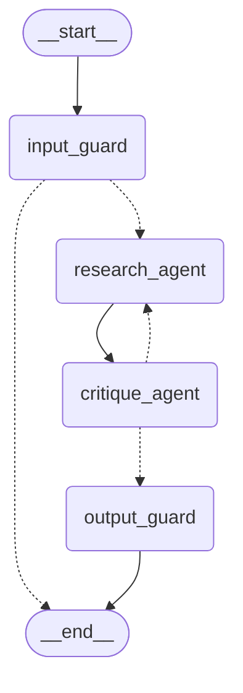

# Solution — CortexRE Multi-Agent Asset Management System

## Architecture

### Workflow Graph

<!--  -->

Each node is isolated and stateful. LangGraph pushes updates to the shared `AgentState` automatically. The flow uses a ReAct pattern wrapped in safeguards:



---

## Implementation Choices

### LLM: LiteLLM (provider-agnostic)

The agent uses [LiteLLM](https://docs.litellm.ai) as a unified proxy so the provider can be changed **without any code changes** — only the `LLM_MODEL` env var needs updating.

| Example `LLM_MODEL` value             | Provider                   |
| ------------------------------------- | -------------------------- |
| `openai/gpt-4o-mini` _(default)_      | OpenAI                     |
| `anthropic/claude-3-5-haiku-20241022` | Anthropic                  |
| `ollama/llama3.2`                     | Local Ollama (open-source) |
| `gemini/gemini-1.5-flash`             | Google                     |

**`temperature=0`** — Deterministic output is critical for JSON extraction.

### LLM Service Layer (`src/services/llm/`)

All LLM interactions are isolated in `LLMService`, which exposes multiple methods for gate-keeping and generation:

| Method                                     | Stage | Description                                             |
| ------------------------------------------ | ----- | ------------------------------------------------------- |
| `check_input(query)`                       | Guard | Validates query relevance and blocks prompt injection   |
| `critique_response(..., draft_answer)`     | Loop  | Critiques the draft answer for accuracy/hallucinations  |
| `check_output(query, known_props, answer)` | Guard | Final validation before outputting to the user          |
| `chat_model` property                      | Agent | Returns a LangChain `ChatLiteLLM` instance for bindings |

Nodes receive the service via `state["_llm"]` (injected by `_inject_context` in `workflow.py`).

### Agent Nodes (`src/agents/nodes/`)

Each LangGraph node lives in its own file for clarity and testability:

| File                | Node                              |
| ------------------- | --------------------------------- |
| `input_guard.py`    | Blocks off-topic queries          |
| `research_agent.py` | ReAct agent for tool execution    |
| `critique_agent.py` | Reviews and corrects drafts       |
| `output_guard.py`   | Validates final output formatting |

### Tools: `@tool(parse_docstring=True)` factory pattern

All pandas operations are wrapped with LangChain's `@tool` decorator and bundled into `create_tools(df)`:

- **Closure over `df`**: DataFrame is captured once at startup; tool arguments remain JSON-serialisable.
- **`ToolError`**: Converts data-quality issues (missing property, unknown year) into user-friendly messages.

### Settings: `pydantic-settings` + `lru_cache`

All environment variables are declared as typed fields on a `Settings` class with Pydantic validation. `get_settings()` is wrapped in `@lru_cache` and a pre-cached `settings` singleton is exported for convenience — no scattered `os.getenv()` calls.

### Prompts as Markdown files (`src/agents/prompts/*.md`)

Prompts are stored as `.md` files and loaded at runtime via `loader.py`:

- Prompt engineers can edit language without touching Python.
- The `{property_list}` placeholder in `extractor.md` is filled at runtime.

### Error handling

| Scenario                   | How handled                                                                        |
| -------------------------- | ---------------------------------------------------------------------------------- |
| Property not in dataset    | Tool returns a `ToolError` containing a helpful fuzzy-matched suggestion           |
| Out-of-scope query         | `Input Guard` returns `allowed=False` and blocks execution early                   |
| Hallucinations / Fake data | `Critique Agent` notices tool outputs don't match the answer and requests revision |
| LLM / API failure          | Exceptions like `LLMInvocationError` handled gracefully, fallback response served  |
| Repeated failures          | `revision_count` in state limits feedback loops (stops at `MAX_REVISIONS`)         |

---

## Project Structure

```
src/
├── api/
│   ├── deps.py              # FastAPI dependencies (service singletons)
│   ├── endpoints.py         # API route handlers
│   ├── exceptions.py        # Global exception handlers
│   └── schemas.py           # Pydantic request/response models
├── agents/
│   ├── nodes/               # One file per LangGraph node
│   │   ├── critique_agent.py
│   │   ├── input_guard.py
│   │   ├── output_guard.py
│   │   └── research_agent.py
│   ├── prompts/             # Markdown system prompts
│   ├── tools/               # Pandas-based LangChain tools
│   ├── state.py             # AgentState TypedDict
│   └── workflow.py          # StateGraph assembly
├── services/
│   ├── agent/               # Agent lifecycle management
│   │   ├── exceptions.py
│   │   └── service.py
│   ├── llm/                 # LiteLLM wrapper (all LLM calls)
│   │   ├── exceptions.py
│   │   └── service.py
│   └── portfolio/           # Data loading and calculations
│       ├── asset_manager.py
│       ├── exceptions.py
│       ├── normalization.py
│       └── service.py
├── evaluation/            # TruLens and CI evaluation scripts
│   ├── evaluation.py
│   ├── feedbacks.py
│   ├── ground_truth.py
│   └── runner.py
├── frontend/
│   └── chat_ui.py           # Streamlit UI
├── core/
│   ├── config.py            # Pydantic Settings + lru_cache
│   └── logging_config.py    # Loguru configuration
└── main.py                  # FastAPI application entry point
```

---

## How to Run

### Using Makefile (Easiest)

```bash
make install          # Install dependencies
make run-api          # Start FastAPI backend
make run-ui           # Start Streamlit UI
make evaluate-trulens # Run TruLens evaluation
make lint             # Run ruff linting
make docker-up        # Start with Docker Compose
```

### Local Setup (Manual)

1. **Install dependencies**:

   ```bash
   uv sync
   ```

2. **Configure environment**:

   ```bash
   cp .env.example .env
   # Edit LLM_MODEL and the matching API key
   ```

3. **Start the API**:

   ```bash
   uv run python src/main.py
   ```

4. **Start the UI**:
   ```bash
   uv run streamlit run src/frontend/app.py
   ```

### Running with Docker

```bash
make docker-up    # Build and start all services
make docker-down  # Stop and remove containers
```

- **Streamlit UI**: [http://localhost:8501](http://localhost:8501)
- **FastAPI docs**: [http://localhost:8000/docs](http://localhost:8000/docs)

---

## Evaluation

TruLens LLM-graded evaluation is provided via `src/evaluation/trulens_eval.py`.

It measures three feedback dimensions for each test query:

| Metric                | Description                                    |
| --------------------- | ---------------------------------------------- |
| **Answer Relevance**  | Does the answer address the user's question?   |
| **Groundedness**      | Is the answer supported by the retrieved data? |
| **Context Relevance** | Is the context passed to the LLM on-topic?     |

Results are saved to `tests/evaluation/trulens.sqlite` and `tests/evaluation/trulens_report.json`.

```bash
make evaluate-trulens
# or with dashboard:
uv run src/evaluation/evaluation.py --dashboard
```

---

## Sample Queries

| Query                                               | Intent                                      |
| --------------------------------------------------- | ------------------------------------------- |
| "What is the P&L for Building A in 2024?"           | Returns correct property income statement   |
| "Compare all properties by NOI"                     | Compares relative metrics successfully      |
| "Which property had the highest OER in 2025?"       | Uses OER data and aggregation correctly     |
| "Show the top expense drivers across the portfolio" | Retrieves overall portfolio expense drivers |
| "How did NOI grow from 2024 to 2025?"               | Computes YoY changes internally via tools   |
| "Tell me about 999 Fake Street"                     | Tool fails cleanly with fuzzy-match hint    |
| "Book me a flight to New York"                      | Blocked immediately by `Input Guard`        |
