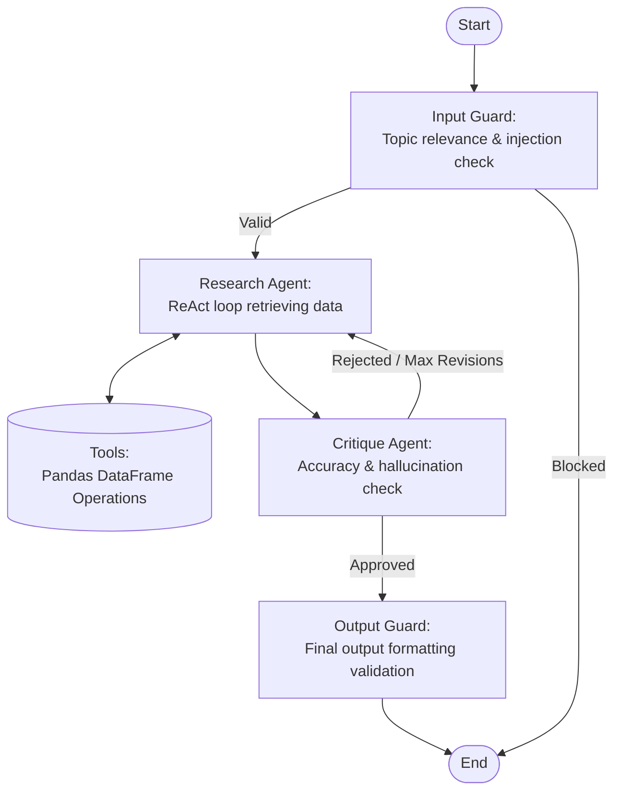

# Solution — CortexRE Multi-Agent Asset Management System

## Architecture

### Workflow Graph

<!--  -->

Each node is isolated and stateful. LangGraph pushes updates to the shared `AgentState` automatically. The flow uses a ReAct pattern wrapped in safeguards:

---

## Implementation Choices

### LLM: LiteLLM (provider-agnostic)

The agent uses [LiteLLM](https://docs.litellm.ai) as a unified proxy so the provider can be changed **without any code changes** — only the `LLM_MODEL` env var needs updating.

| Example `LLM_MODEL` value             | Provider                   |
| ------------------------------------- | -------------------------- |
| `openai/gpt-4o-mini` _(default)_      | OpenAI                     |
| `anthropic/claude-3-5-haiku-20241022` | Anthropic                  |
| `ollama/llama3.2`                     | Local Ollama (open-source) |
| `gemini/gemini-1.5-flash`             | Google                     |

**`temperature=0`** — Deterministic output is critical for JSON extraction.

### LLM Service Layer (`src/services/llm/`)

All LLM interactions are isolated in `LLMService`, which exposes multiple methods for gate-keeping and generation:

| Method                                     | Stage | Description                                             |
| ------------------------------------------ | ----- | ------------------------------------------------------- |
| `check_input(query)`                       | Guard | Validates query relevance and blocks prompt injection   |
| `critique_response(..., draft_answer)`     | Loop  | Critiques the draft answer for accuracy/hallucinations  |
| `check_output(query, known_props, answer)` | Guard | Final validation before outputting to the user          |
| `chat_model` property                      | Agent | Returns a LangChain `ChatLiteLLM` instance for bindings |

Nodes receive the service via `state["_llm"]` (injected by `_inject_context` in `workflow.py`).

### Agent Nodes (`src/agents/nodes/`)

Each LangGraph node lives in its own file for clarity and testability:

| File                | Node                              |
| ------------------- | --------------------------------- |
| `input_guard.py`    | Blocks off-topic queries          |
| `research_agent.py` | ReAct agent for tool execution    |
| `critique_agent.py` | Reviews and corrects drafts       |
| `output_guard.py`   | Validates final output formatting |

### Tools: `@tool(parse_docstring=True)` factory pattern

All pandas operations are wrapped with LangChain's `@tool` decorator and bundled into `create_tools(df)`:

- **Closure over `df`**: DataFrame is captured once at startup; tool arguments remain JSON-serialisable.
- **`ToolError`**: Converts data-quality issues (missing property, unknown year) into user-friendly messages.

### Why not `create_pandas_dataframe_agent`?

While LangChain provides a built-in `create_pandas_dataframe_agent`, we explicitly chose a custom LangGraph implementation for several critical reasons:

- **Security (No Arbitrary Code):** The built-in agent uses a Python REPL (`PythonAstREPLTool`) allowing the LLM to execute arbitrary code. In a production API, this is a massive vulnerability. Our approach strictly limits the LLM to predefined, safe `@tool` functions.
- **Guardrail Architecture:** A monolithic ReAct agent bypasses our robust pipeline (Input Guard ➔ Research Agent ➔ Critique Agent ➔ Output Guard). Our custom graph allows us to intercept the reasoning process, critique hallucinations, and enforce strict boundary conditions.
- **Model Compatibility:** The built-in agent relies on complex, hardcoded prompts heavily biased toward OpenAI. Our solution uses isolated Markdown prompts out-of-the-box (`src/agents/prompts/*.md`), ensuring high compatibility across various open-source and proprietary models via LiteLLM.
- **Custom Error Handling UX:** Instead of dumping raw `KeyError` stack traces from a Python REPL into the prompt, our custom tools gracefully catch data issues and return helpful, human-readable `ToolError` messages (e.g., fuzzy-matched suggestions for typo'd properties).

### Settings: `pydantic-settings` + `lru_cache`

All environment variables are declared as typed fields on a `Settings` class with Pydantic validation. `get_settings()` is wrapped in `@lru_cache` and a pre-cached `settings` singleton is exported for convenience — no scattered `os.getenv()` calls.

### Prompts as Markdown files (`src/agents/prompts/*.md`)

Prompts are stored as `.md` files and loaded at runtime via `loader.py`:

- Prompt engineers can edit language without touching Python.
- The `{property_list}` placeholder in `extractor.md` is filled at runtime.

| Scenario                   | How handled                                                                        |
| -------------------------- | ---------------------------------------------------------------------------------- |
| Property not in dataset    | Tool returns a `ToolError` containing a helpful fuzzy-matched suggestion           |
| Out-of-scope query         | `Input Guard` returns `allowed=False` and blocks execution early                   |
| Hallucinations / Fake data | `Critique Agent` notices tool outputs don't match the answer and requests revision |
| LLM / API failure          | Exceptions like `LLMInvocationError` handled gracefully, fallback response served  |
| Repeated failures          | `revision_count` in state limits feedback loops (stops at `MAX_REVISIONS`)         |

---

## Multi-user & Session Management

To ensure data privacy and independent conversation contexts, we implemented dynamic `thread_id` management:

- **Frontend (Streamlit):**
  - Uses `st.session_state` to store a unique `uuid4` per browser session.
  - Provides a **"New Chat"** button in the sidebar that clears the message history and rotates the session UUID.
- **Backend (FastAPI):**
  - The `/query` endpoint now accepts an optional `thread_id` in the `QueryRequest` body.
  - This ID is passed directly to the LangGraph checkpointer, ensuring that conversation history is persisted correctly per user/session.

---

## Evaluation Strategy

We chose TruLens for LLM-graded evaluation to quantitatively measure the performance and safety of the ReAct agent. It runs against a golden dataset of test queries across three dimensions:

| Metric                | Description                                    |
| --------------------- | ---------------------------------------------- |
| **Answer Relevance**  | Does the answer address the user's question?   |
| **Groundedness**      | Is the answer supported by the retrieved data? |
| **Context Relevance** | Is the context passed to the LLM on-topic?     |

This triad ensures the agent not only answers the question but does so using _only_ the data retrieved from the predefined tools, effectively measuring our mitigation of hallucinations.
